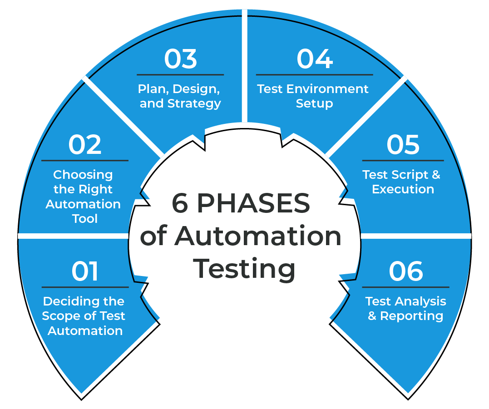

# Topic 8: AI-Driven Test Automation: Integrating AI

Artificial Intelligence (AI) has transformed various industries, including test automation. AI encompasses a range of technologies that simulate human intelligence, enabling systems to perform tasks such as speech recognition, natural language processing, text generation, and decision-making.

While AI is not a new concept, it has gained significant attention worldwide since 2022. EPAM has invested heavily in this area, offering cutting-edge AI technologies to their customers and training professionals to explore its potential.

By incorporating AI, testers can automate numerous aspects of the testing lifecycle, leading to significant time savings and improved testing quality. This topic will explore the integration of AI into test automation, covering areas such as automating test documentation, design and implementing test cases.

## References

- Generative AI: Models and Applications – [OpenAI Blog](https://openai.com/blog)
- The Automation Testing Life Cycle: Concepts and Tools – [Software Testing Help](https://www.softwaretestinghelp.com)
- Prompt Engineering Fundamentals - [Learn portal](https://learn.epam.com/catalog/detailsPage?id=39d51076-a3c1-4d8c-9dca-7417d31d8bad)
- AI-Assisted Test Automation - [Learn portal](https://learn.epam.com/catalog/detailsPage?id=e4fce892-1416-4482-8484-981df25751cd)
- GitHub Copilot - [Learn portal](https://learn.epam.com/catalog/detailsPage?id=0f6bf675-6e68-4b82-bb7d-96d357461673)
- LEAP - [AI Delivery Platform](https://leap.epam.com/assistants/github-copilot)

---

## Generative AI

It refers to a branch of artificial intelligence that focuses on generating new and original content, rather than analyzing or making predictions based on existing data. It involves training models to create something new, such as images, texts, music, or even video.

Here are five good examples of generative AI:
1. [Pix2Pix](https://affinelayer.com/pix2pix/): This model can generate realistic images by learning from pairs of images, such as converting black and white sketches to colorful images.

2. [GPT-3](https://openai.com/research/gpt-3/): GPT-3 (**G**enerative **P**re-trained **T**ransformer 3) is a language model capable of generating human-like text based on prompts or questions. It has been used for various tasks such as writing articles, answering queries, and even generating code snippets. Nowadays, there are several models with the same purposes. Below is a comparison of popular generative AI models and their use cases:

    | **Model**                  | **Main Differences**                                                                                 | **When to Use**                                                              | **When to Avoid**                                                          |
    |:---------------------------|:-----------------------------------------------------------------------------------------------------|:-----------------------------------------------------------------------------|:---------------------------------------------------------------------------|
    | **GPT-3 (OpenAI)**         | Language model for generating human-like text based on prompts or questions.                         | Use when generating text for various tasks such as writing or querying.      | Avoid when specific domain expertise or fine-grained control is needed.    |
    | **Gemini (Google)**        | More focused on code generation and assistance for software development tasks.                       | Suitable for generating code snippets and assisting in programming tasks.    | Not ideal for non-programming tasks or general text generation.            |
    | **Bing Model (Microsoft)** | Developed for search and text-based applications, providing AI-generated suggestions and responses.  | Well-suited for enhancing search experiences or generating recommendations.  | May not be suitable for creative content generation or specialized tasks.  |

3. [DALL-E](https://openai.com/research/dall-e/): Developed by OpenAI, DALL-E can generate original images from textual descriptions. It can create unique and imaginative visuals from text prompts that were never seen during training.

4. [DeepDream](https://deepdreamgenerator.com/): DeepDream produces fascinating and surreal images by applying neural network patterns back onto an input image. It can create dream-like visuals by magnifying and enhancing specific features of the original image.

5. [MuseNet](https://openai.com/blog/musenet/): MuseNet is an AI model that generates original musical compositions in various styles and genres. It can create harmonies, melodies, and even orchestral arrangements that are indistinguishable from human-composed pieces.

### GitHub Copilot

GitHub Copilot is an AI-powered code completion tool developed by GitHub in collaboration with OpenAI. It uses a generative AI model to assist developers by automatically suggesting code completions and generating code snippets based on the context within their code editors.

| **Tool**           | **Pricing**                                         | **Supported IDEs**                                                                                                     | **Pros**                                                                                                                                                                                                                                                                               | **Cons**                                                                                                                                                                                                                                           |
|--------------------|-----------------------------------------------------|------------------------------------------------------------------------------------------------------------------------|----------------------------------------------------------------------------------------------------------------------------------------------------------------------------------------------------------------------------------------------------------------------------------------|----------------------------------------------------------------------------------------------------------------------------------------------------------------------------------------------------------------------------------------------------|
| **Codota**         | Free for basic use; Team/Enterprise plans available | IntelliJ IDEA, PyCharm, Eclipse, Android Studio, VS Code                                                               | - **Contextual Code Suggestions:** Provides smart completions for Java and Kotlin.   - **Good for Large Teams:** Enterprise-friendly collaboration features.   - **Focus on Popular Languages:** Strong Java/Kotlin support.                                                     | - **Limited Language Support:** Primarily for Java and Kotlin.   - **Performance Issues:** Can be slower on large projects.   - **Less Versatile:** Does not support as many languages compared to competitors.                              |
| **Codeium**        | Free for individuals; Enterprise pricing available  | VS Code, IntelliJ IDEA, PyCharm, Android Studio, JetBrains IDEs, Vim/Neovim, Sublime Text, Jupyter Notebooks, and more | - **AI-Powered Autocompletion:** Helps developers write code faster.   - **Supports Multiple Languages:** Works with 70+ programming languages.   - **Privacy Focus:** Data is not shared without consent.   - **Seamless Integration:** Integrates easily into popular IDEs. | - **Limited Features in Free Plan:** Advanced enterprise features require a subscription.   - **Internet Dependency:** Autocompletion may require internet access.   - **Newer in Market:** May lack features compared to older competitors. |
| **GitHub Copilot** | $10/month for individuals; $19/month for businesses | VS Code, Visual Studio, JetBrains IDEs, Neovim                                                                         | - **Powered by OpenAI Codex:** Delivers accurate and robust code suggestions.   - **Wide Language Support:** Supports dozens of programming languages.   - **GitHub Ecosystem:** Integrates smoothly with GitHub repositories.                                                   | - **Paid Tool:** No free tier for individual users.   - **Internet Dependency:** Requires a stable connection.   - **Occasional Redundancy:** May generate repetitive or unnecessary code suggestions.                                       |
| **Tabnine**        | Free tier; Pro plan at $12/month                    | VS Code, IntelliJ, PyCharm, Android Studio, Vim, Sublime Text, Eclipse, Jupyter, and more                              | - **AI-Based Code Completion:** Works with multiple programming languages.   - **Local and Cloud Options:** Can run locally for privacy-sensitive work.   - **Fast and Lightweight:** Quick performance in most environments.                                                    | - **Limited Free Tier:** Free plan lacks advanced features.   - **Requires Configuration:** May need manual fine-tuning for the best results.                                                                                                   |

## Automation Testing Life Cycle

Source: EPAM Systems

### Deciding the Scope of Test Automation

Not all tests can be automated. We, as Test Engineers, need to discover the feasibility of a test to be automated. This analysis should be based on the manual test cases to help design the test scripts. It is not only about the possibility of a test to be automated but, mainly, based on factors like cost, team size, expertise and capabilities.

### Choosing the Right Automation Tool

When selecting an automation tool, important factors to consider include the project's technologies, team familiarity, intuitiveness, and flexibility. For browser compatibility testing, the availability of multiple browsers is a crucial factor. Conducting a comparative study of various automation tools is recommended before making a final decision.

### Plan, Design, and Strategy

In the planning and design phase, the test engineers create a test architecture to outline the structure and management of test procedures. This involves identifying manual test cases for automation, selecting a framework, building an automated test suite using a chosen test management tool, addressing factors like background, risk, and dependencies in the test plan, and obtaining stakeholder approval on the test strategy.

### Test Environment Setup

During the test environment setup phase, the focus is on ensuring the necessary software, licenses, and hardware are available. Checklists for automation tools, system configurations, and applications are maintained. It is crucial to have data similar to the production environment, perform load testing, and test across various platforms. Documentation of all configurations and manuals is essential in a centralized repository.

### Test Script & Execution

In the test script and execution phase, the focus is on developing and executing test scripts based on project requirements. The test scripts should be reusable, easy to understand, and well-structured. During execution, the test cases should cover all functional aspects and be executed across different platforms and environments. Grouping test scripts into logical batches can optimize execution time and resource utilization. It is important to document the test results and any discovered bugs for future reference in the ATLC.

### Test Analysis & Reporting

In the test analysis and reporting phase, the focus is on gathering and sharing the test automation results with the team, stakeholders, and clients. It is crucial for the test results to be presented in a clear and understandable manner, using clear filters and visualizations, such as charts or dashboards, to present results. Additionally, regular maintenance is required to update and automate test cases whenever there are functional or UI changes, or new testing criteria.

## Challenges of AI-Driven Test Automation

While AI enhances test automation, it comes with challenges:
- **Complexity in Implementation:** Integrating AI tools requires technical expertise and a steep learning curve.
- **Data Dependency:** AI relies heavily on quality data for training; insufficient or biased data can impact outcomes.
- **High Initial Investment:** Implementing AI-driven solutions often involves significant time, cost, and resources.
- **Limited Interpretability:** Understanding AI decisions, especially in complex scenarios, can be difficult.
- **Maintenance Overhead:** AI models need regular updates to adapt to new test scenarios and evolving applications.
