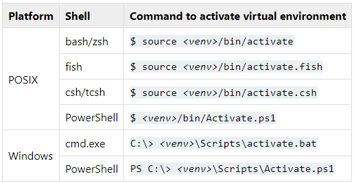

# Section 1: Setting Up Tools

In this section, we will set up the essential tools you need for the course. These include installing Python, setting up Git for version control, and choosing an IDE for coding. We'll also introduce BeeCrowd, a platform where you can practice coding challenges related to testing concepts. Let's ensure that you have the necessary tools installed and ready. These tools will be used throughout the course.

## References
1. [Python Downloads - Python.org](https://www.python.org/downloads/)
2. [Git Documentation - Git SCM](https://git-scm.com/doc)
3. [Python Documentation](https://docs.python.org/3/contents.html)
4. [PyCharm Download - JetBrains](https://www.jetbrains.com/pycharm/download/)
5. [Visual Studio Code - Official Site](https://code.visualstudio.com/)
6. [BeeCrowd - Official Code Challenge Platform](https://www.beecrowd.com.br/)

---


## 1.1 Python Installation

Python is the main language we will use for writing test scripts.

### Instructions:
1. Go to the [Python official website](https://www.python.org/downloads/).
2. Download the latest version of Python for your operating system (Windows, macOS, Linux).
3. During installation, make sure to check the box **"Add Python to PATH"**.
4. Verify the installation by opening a terminal or command prompt and typing:
   ```bash
   $ python --version
   ```


## 1.2 Git Installation

Git is a version control tool that will help us manage code repositories. We will use it to track changes in our test scripts and collaborate.

### Instructions:
1. Got to the [Git official website](https://git-scm.com/downloads).
2. Download the latest version of Git for your operatin system (Windows, macOS, Linux).
3. Follow the installation steps for your operating system.
4. Verify the installation by typing the following in the terminal or command prompt:
   ```bash
   $ git --version
   ```
5. Set up a [GitHub](https://github.com/) account to host your code repositories and collaborate with others.


## 1.3 IDE Installation

An Integrated Development Environment (IDE) helps you write, manage, and debug your code efficiently. You can choose any IDE you prefer, but we recommend one of the following:

### Option 1: PyCharm
1. Download PyCharm from the [JetBrains](https://www.jetbrains.com/pycharm/download/?section=windows) website.
2. Choose the Community edition, which is free (you may need to scrolling down a bit to find it).
3. Follow the installation steps.

### Option 2: Visual Studio Code (VS Code)
1. Download VS Code from the [Visual Studio Code](https://code.visualstudio.com/download) official website.
2. Follow the installation instructions for your OS.
3. Install the Python extension for better code management and debugging.

### Hands-On Task:

After installing your chosen IDE, open a new Python project and write a simple "Hello, World" script to ensure everything is working:
   ```python
   print("Hello, World!")
   ```


## 1.4 Set a Virtual Environment

A virtual environment is an isolated Python environment where it will have its own Python interpreter, libraries and scripts installed.
Follow the [Python documentation](https://docs.python.org/3/library/venv.html) instruction to have it done.

### Instructions
1. Create a virtual environment inside a folder
   ```bash
   $ python -m venv /path/to/new/virtual/environment
   ```
2. Activate the new virtual environment


### Hands-On Task:

1. Create a new virtual environment for the Week 1 class.
2. Activate the new virtual environment


## 1.5 BeeCrowd Code Challenges

BeeCrowd is a platform where you can practice your coding skills through challenges. We'll use it to solve some basic algorithmic problems to strengthen your problem-solving skills.

### Instructions:
1. Go to [BeeCrowd](https://beecrowd.com/).
2. Sign up for a free account.
3. Familiarize yourself with the interface and try solving one or two basic problems.

### Hands-On Task:

Complete the challenges [`1000`](https://judge.beecrowd.com/en/problems/view/1000) and [`1001`](https://judge.beecrowd.com/en/problems/view/1001) from the Beginner section.
